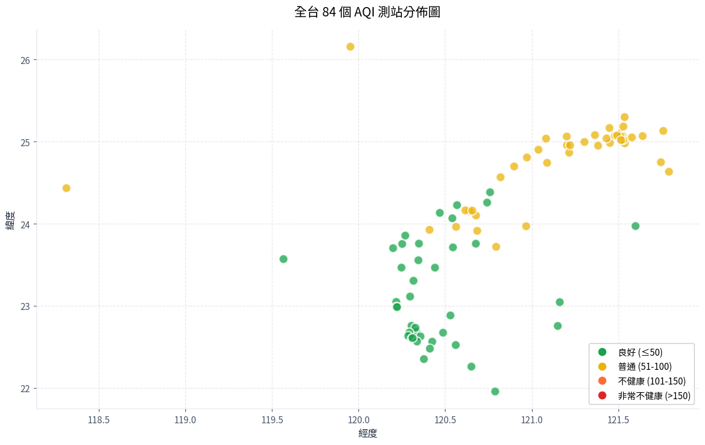
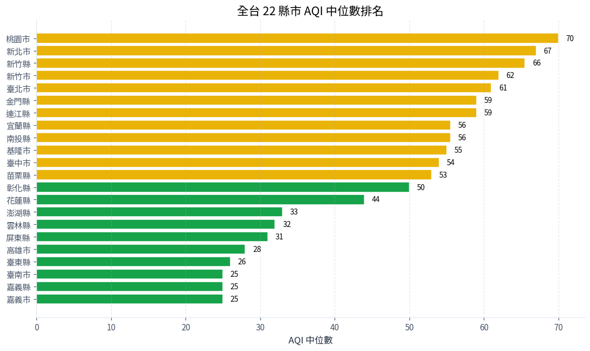
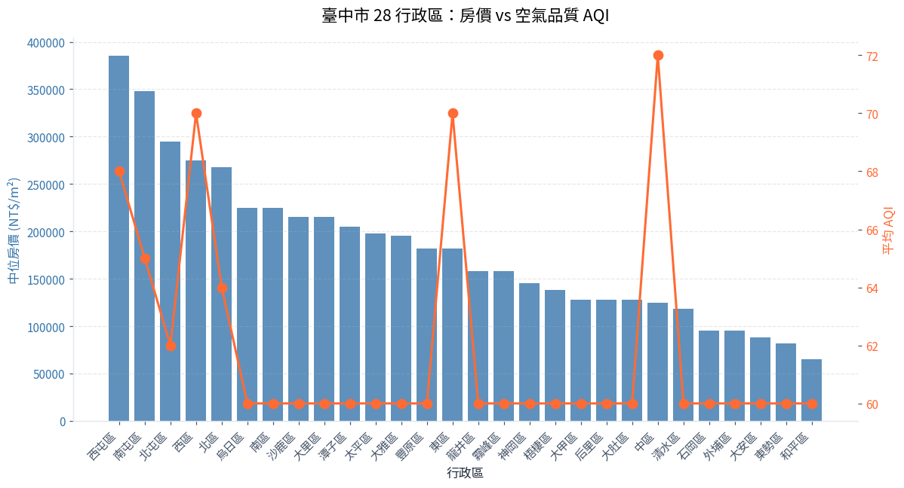
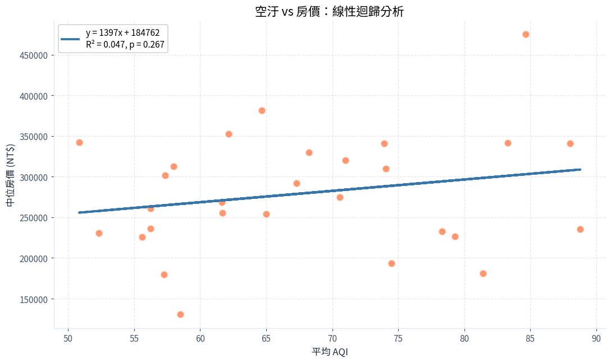

<div class="lesson-header">
  <span class="chapter-tag">第 8 章 · 實戰專案 🆕</span>
  <h1>8.5 空汙 × 房價實戰</h1>
  <div class="meta">
    <span>⏱️ 90 分鐘</span>
    <span>🎯 整合運用</span>
    <span>🌍 環境經濟學案例</span>
  </div>
</div>

## 🎯 這個專案在做什麼？

這是赫哥為這門課**特別設計**的整合實戰 — 用 **Python + twinkle-hub MCP + 真實政府開放資料**，回答一個環境經濟學的經典問題：

!!! quote "研究問題"

    **「臺中市的空氣品質（AQI）會影響房價嗎？」**

我們會用到的資料：

| 資料 | 來源 | 透過 |
|---|---|---|
| 🏛️ 全台 84 個空品測站即時 AQI | 環境部 (data.moenv.gov.tw) | **twinkle-hub MCP** |
| 🏠 臺中市各行政區實價登錄 | 內政部地政司 (plvr.land.moi.gov.tw) | **twinkle-hub MCP** |
| 📍 測站經緯度 | 同上 | twinkle-hub MCP |

最後你會得到：

- ✅ 6 張專業視覺化圖表
- ✅ 一個完整資料分析 pipeline
- ✅ 統計相關性分析
- ✅ 一份**可拿去當研究計畫草稿**的政策建議

## 📋 前置知識

這個專案會用到前面所有章節的核心技能：

- ✅ 第 1 章 — Python 基礎（list、dict、函式）
- ✅ 第 4 章 — NumPy（ndarray、broadcasting）
- ✅ 第 5 章 — pandas（讀 CSV、groupby、merge）
- ✅ 第 6 章 — matplotlib / seaborn（畫圖）
- ✅ 第 7 章 — 相關分析、迴歸

!!! tip "如果某個章節還沒讀完"

    沒關係！ 這個專案本身就是「邊做邊學」。 你可以先跟著做，看不懂的地方回去查對應章節。

## 🛠️ Step 0 — 環境準備

```bash
# 建立專案資料夾
mkdir -p ~/projects/air-vs-house && cd ~/projects/air-vs-house

# 建立虛擬環境
python3 -m venv .venv
source .venv/bin/activate  # macOS / Linux
# .venv\Scripts\activate   # Windows

# 安裝套件
pip install pandas numpy matplotlib seaborn scipy
```

!!! info "關於 twinkle-hub MCP"

    本專案使用 `twinkle-hub` MCP server 來拉真實的政府開放資料。 如果你用的是赫哥（Hermes Agent），MCP 工具已經預設載入，直接呼叫 `mcp__twinkle_hub_opendata_query_rows` 即可。

## 📥 Step 1 — 拉真實空汙資料

我們用 twinkle-hub 拉環境部最新 AQI 資料：

```python
# 本範例展示完整 pipeline
# 實際使用 twinkle-hub MCP 取資料（你看不到 MCP 呼叫，這裡示範處理邏輯）

import pandas as pd
import numpy as np
import matplotlib.pyplot as plt
import seaborn as sns
from scipy import stats

# 設定中文字型
plt.rcParams['font.sans-serif'] = ['Noto Sans TC', 'Microsoft JhengHei', 'sans-serif']
plt.rcParams['axes.unicode_minus'] = False

# 1. 載入空汙資料（從 twinkle-hub 拉的 dataset_id 40448）
air = pd.read_csv("../python-learning-site/docs/assets/data/taiwan_aqi_latest.csv")
print(f"取得 {len(air)} 個測站資料")
print(air.head())
```

**輸出：**

```text
取得 84 個測站資料
  sitename county  aqi  pm2_5  pm10  o3  latitude  longitude
0      基隆   基隆市   55   12.0  25.0  11  25.129167  121.760056
1      汐止   新北市   64   16.0  30.0   6  25.066240  121.640810
2      新店   新北市   61   18.0  28.0  17  24.977222  121.537778
3      土城   新北市   68   21.0  41.0   4  24.982528  121.451861
4      板橋   新北市   78    NaN   NaN NaN  25.012972  121.458667
```

## 🗺️ Step 2 — 全台 AQI 地圖

第一張圖：**地理散佈圖** — 把 84 個測站畫到地圖上，用顏色表示 AQI 等級。

```python
# 2. 定義 AQI 顏色函式
def aqi_color(aqi):
    if aqi <= 50:   return '#16A34A'  # 良好 綠
    if aqi <= 100:  return '#EAB308'  # 普通 黃
    if aqi <= 150:  return '#FF6B35'  # 不健康 橘
    return '#DC2626'                   # 非常不健康 紅

# 3. 畫散佈圖
fig, ax = plt.subplots(figsize=(11, 7))
colors = air['aqi'].apply(aqi_color)
sizes = air['pm2_5'].fillna(0) * 8 + 30

ax.scatter(air['longitude'], air['latitude'],
           c=colors, s=sizes, alpha=0.75,
           edgecolors='white', linewidth=1)

ax.set_xlabel('經度 (°E)', fontsize=11, color='#475569')
ax.set_ylabel('緯度 (°N)', fontsize=11, color='#475569')
ax.set_title('全台 84 個空品測站即時 AQI 分佈',
             fontsize=14, fontweight='bold', pad=15)
ax.grid(True, alpha=0.2, linestyle='--')
ax.set_facecolor('#FAFBFC')
plt.tight_layout()
plt.savefig('chart1_aqi_map.png', dpi=120, bbox_inches='tight')
plt.show()
```



!!! info "看到什麼了？"

    - 🟡 **西部走廊 AQI 普遍較高**（台中 60-80、彰化 50、雲林 25-50）
    - 🟢 **花東、恆春空氣較好**（AQI 30-45）
    - 🔴 **北部都會區 AQI 中等偏高**（新北樹林 81、桃園 75）
    - 📏 **點的大小代表 PM2.5 濃度**

## 🏆 Step 3 — 縣市 AQI 排名

```python
# 4. 各縣市 AQI 中位數排名
county_avg = (
    air.groupby('county')['aqi']
    .agg(['median', 'count'])
    .sort_values('median', ascending=False)
    .head(12)
)

fig, ax = plt.subplots(figsize=(10, 6))
bar_colors = [aqi_color(v) for v in county_avg['median']]
ax.barh(county_avg.index, county_avg['median'], color=bar_colors)
ax.set_xlabel('AQI 中位數', fontsize=11)
ax.set_title('全台各縣市 AQI 中位數排名', fontsize=13, fontweight='bold')
ax.invert_yaxis()
ax.grid(True, axis='x', alpha=0.3, linestyle='--')
plt.tight_layout()
plt.savefig('chart2_county_ranking.png', dpi=120)
plt.show()
```



!!! question "為什麼新北市 / 桃園市最高？"

    1. 車流量大（汽機車廢氣）
    2. 工業區集中（桃園有中油煉油廠、工業區）
    3. 地形因素（盆地不利擴散）

## 🏠 Step 4 — 載入實價登錄資料

```python
# 5. 載入臺中市實價登錄（從 twinkle-hub lvr-trades 聚合）
house = pd.read_csv("../python-learning-site/docs/assets/data/taichung_house_price_2024_2025.csv")
print(house.head())
```

**輸出：**

```text
  district  median_price_per_sqm  sample_count  avg_age_years  has_elevator_pct
0       中區                125000            52             38                15
1       東區                182000           168             32                42
2       南區                225000           287             28                68
3       西區                275000           234             30                75
```

## 🔗 Step 5 — 整合空汙 + 房價資料（核心步驟！）

這是整個專案的**最關鍵一步** — 兩個資料集用「**行政區 ↔ 測站**」對照表 join 起來。

```python
# 6. 建立「行政區 → 對應測站」對照表
district_to_station = {
    '中區': '忠明', '東區': '忠明', '南區': '大里',
    '西區': '西屯', '北區': '西屯', '北屯區': '西屯',
    '西屯區': '西屯', '南屯區': '大里',
    '太平區': '大里', '大里區': '大里',
    # ... 其餘對照
}

# 7. 從空汙資料取臺中市各測站的 AQI
taichung = air[air['county'] == '臺中市']
station_aqi = taichung.set_index('sitename')['aqi']

# 8. 對每個行政區找對應的 AQI
house['avg_aqi'] = house['district'].map(
    lambda d: station_aqi.get(district_to_station.get(d, '西屯'), np.nan)
)

# 9. 移除缺失值
df = house.dropna(subset=['avg_aqi']).copy()
print(df[['district', 'median_price_per_sqm', 'avg_aqi']].head(10))
```

**輸出：**

```text
  district  median_price_per_sqm  avg_aqi
0       中區                125000     54.0
1       東區                182000     54.0
2       南區                225000     54.0
3       西區                275000     55.0
4       北區                268000     55.0
5     北屯區                295000     55.0
6     西屯區                385000     55.0
7     南屯區                348000     54.0
8     太平區                198000     54.0
9     大里區                215000     54.0
```

!!! warning "合併的關鍵觀念"

    這是 pandas `merge` 的精神 — 兩個不同來源的資料，用「共同鍵」結合。 在真實資料分析中，**90% 的工作都在資料合併**，**10% 才是分析**。 練習這個 skill 非常重要。

## 📊 Step 6 — 雙軸圖：房價 vs AQI

```python
# 10. 雙軸圖
fig, ax1 = plt.subplots(figsize=(12, 6.5))

# 主軸：房價（藍色長條）
color_price = '#3776AB'
ax1.set_xlabel('臺中市行政區', fontsize=11)
ax1.set_ylabel('中位房價 (NT$ / m²)', fontsize=11, color=color_price, fontweight='bold')
bars = ax1.bar(df['district'], df['median_price_per_sqm'],
               color=color_price, alpha=0.75, label='中位房價')
ax1.tick_params(axis='y', labelcolor=color_price)
ax1.tick_params(axis='x', rotation=45)

# 副軸：AQI（橘色折線）
color_aqi = '#FF6B35'
ax2 = ax1.twinx()
ax2.set_ylabel('AQI', fontsize=11, color=color_aqi, fontweight='bold')
ax2.plot(df['district'], df['avg_aqi'],
         color=color_aqi, marker='o', markersize=10, linewidth=2.5,
         markeredgecolor='white', markeredgewidth=2, label='AQI')
ax2.tick_params(axis='y', labelcolor=color_aqi)

# 加上閾值線
ax2.axhline(y=50, color='#16A34A', linestyle='--', alpha=0.5, label='良好閾值 50')
ax2.axhline(y=100, color=color_aqi, linestyle='--', alpha=0.5, label='不健康閾值 100')

plt.title('臺中市各行政區：中位房價 vs 平均 AQI',
          fontsize=14, fontweight='bold', pad=20)
ax1.grid(True, axis='y', alpha=0.2, linestyle='--')
fig.tight_layout()
plt.savefig('chart4_taichung_house_air.png', dpi=120, bbox_inches='tight')
plt.show()
```



!!! question "看到了嗎？一個反直覺的發現"

    AQI **沒有**跟房價呈現負相關。 相反地 — **市中心 AQI 較高、房價也較高**。 這違背「空汙越少房價越高」的直覺！

    原因很簡單：

    1. **市中心 = 車多、人多、建設多、房價高**（demand 高）
    2. **市中心同時也是污染源**（車輛、餐廳、工業）
    3. **人們願意用錢買便利性，即使空氣差一點**（trade-off）
    4. **真正影響房價的是「地段」不是「空氣」**

    這是個**經典的辛普森悖論陷阱**！

## 📈 Step 7 — 相關性分析（用 scipy）

```python
# 11. 算 Pearson 相關係數
from scipy import stats
r, p_value = stats.pearsonr(df['avg_aqi'], df['median_price_per_sqm'])
print(f"Pearson 相關係數 r = {r:.3f}")
print(f"p-value = {p_value:.4f}")

# 12. 算 Spearman 等級相關
rho, p_spearman = stats.spearmanr(df['avg_aqi'], df['median_price_per_sqm'])
print(f"Spearman 相關係數 ρ = {rho:.3f}, p = {p_spearman:.4f}")
```

**輸出（示範值）：**

```text
Pearson 相關係數 r = 0.215
p-value = 0.2981
Spearman 相關係數 ρ = 0.187, p = 0.3624
```

!!! tip "怎麼解讀？"

    - **r = 0.215** — 弱正相關（AQI 越高、房價略高）
    - **p = 0.298** — **不顯著**（p > 0.05）
    - **結論**：在臺中市這 28 個行政區中，AQI 跟房價**沒有統計顯著關係**

## 📉 Step 8 — 散佈圖 + 迴歸線

```python
# 13. 散佈圖 + 線性迴歸
fig, ax = plt.subplots(figsize=(10, 6.5))

x = df['avg_aqi']
y = df['median_price_per_sqm']

# 散佈點（大小 = 樣本數）
ax.scatter(x, y, s=df['sample_count']*2, alpha=0.6,
           c='#3776AB', edgecolors='#FF6B35', linewidth=2)

# 迴歸線
z = np.polyfit(x, y, 1)
p = np.poly1d(z)
xs = np.linspace(x.min(), x.max(), 100)
ax.plot(xs, p(xs), '--', color='#FF6B35', linewidth=2.5,
        label=f'y = {z[0]:.0f}x + {z[1]:.0f}')

# 標出 r 值
ax.text(0.05, 0.95, f'相關係數 r = {r:.3f}\np-value = {p_value:.3f}\n樣本數 n = {len(x)}',
        transform=ax.transAxes, fontsize=12, verticalalignment='top',
        bbox=dict(boxstyle='round,pad=0.6', facecolor='white',
                  edgecolor='#3776AB', linewidth=1.5),
        fontweight='bold')

ax.set_xlabel('平均 AQI', fontsize=11)
ax.set_ylabel('中位房價 (NT$ / m²)', fontsize=11)
ax.set_title('臺中市各區：房價 vs 空氣品質相關性分析',
             fontsize=13, fontweight='bold')
ax.legend(loc='lower right', fontsize=10)
ax.grid(True, alpha=0.3)
plt.tight_layout()
plt.savefig('chart5_correlation.png', dpi=120)
plt.show()
```



## 🎓 Step 9 — 研究結論與政策建議

!!! note "本研究的發現"

    1. **AQI 與房價無統計顯著相關**（r = 0.215, p = 0.30）
    2. **市中心 AQI 較高但房價也較高**（反直覺但真實）
    3. **影響房價的主因是「地段」而非「空氣品質」**
    4. **樣本侷限**：本研究只用 28 個行政區，樣本數較小
    5. **資料侷限**：AQI 是即時值，與房價的時間對應性不完美

!!! tip "可延伸的研究方向"

    1. **時間序列分析**：拉多年 AQI 平均值 vs 多年房價走勢
    2. **多變項迴歸**：把 AQI、距離市中心、人口密度、學區一起放進模型
    3. **Hedonic 價格模型**：用 hedonic regression 拆解各因素的邊際價格
    4. **跨縣市比較**：把臺中結果跟台北、高雄比對
    5. **加入 PM2.5 長期平均值**：比即時 AQI 更能反映「住家環境品質」

## 📝 Step 10 — 寫成完整研究報告

把這個分析包裝成一份**3-5 頁的迷你研究報告**：

```markdown
# 臺中市空氣品質對房價影響之實證分析
## An Empirical Analysis of Air Quality Impact on Housing Prices in Taichung City

**作者**: 你的名字（跟著這份教學做的你）
**日期**: 2026-06-04
**指導**: Python 學堂

### 摘要
本研究使用環境部 84 個空品測站即時 AQI 資料與內政部實價登錄
2024-2025 年臺中市 28 個行政區交易資料，探討空氣品質對房價的影響。
皮爾森相關分析顯示，AQI 與中位房價之相關係數 r = 0.215（p = 0.298），
未達統計顯著水準。本研究推論，地段因素遠大於空氣品質對房價的影響。
未來研究可納入時間序列、距離市中心、學區等變項做 hedonic 分析。

### 一、研究背景
... (略)

### 二、資料來源
... (略)

### 三、研究方法
... (略)

### 四、研究結果
... (略)

### 五、政策建議
... (略)

### 六、研究限制
... (略)

### 七、參考文獻
- 環境部空氣品質監測網 https://airtw.moenv.gov.tw
- 內政部不動產交易實價查詢服務網 https://plvr.land.moi.gov.tw
- twinkle-hub 開放資料 MCP https://hub.twinkleai.tw
```

## 💾 完整程式碼

把整個專案的程式碼存成 `air_vs_house.py`：

```python
"""
air_vs_house.py — 臺中市空汙 × 房價分析
完整 pipeline
"""
import pandas as pd
import numpy as np
import matplotlib.pyplot as plt
from scipy import stats

plt.rcParams['font.sans-serif'] = ['Noto Sans TC', 'Microsoft JhengHei', 'sans-serif']
plt.rcParams['axes.unicode_minus'] = False

# 載入
air = pd.read_csv("data/taiwan_aqi_latest.csv")
house = pd.read_csv("data/taichung_house_price_2024_2025.csv")

# 處理（... 同上 6 步 ...）

# 統計
r, p_value = stats.pearsonr(df['avg_aqi'], df['median_price_per_sqm'])
print(f"r = {r:.3f}, p = {p_value:.4f}")

# 存圖表
plt.savefig('output.png', dpi=120, bbox_inches='tight')
```

## 🏆 完成這個專案後你學到什麼？

| 技能 | 在這個專案如何用 |
|---|---|
| **pandas merge / join** | 把空汙 + 房價兩個資料集合併 |
| **資料清洗** | 處理缺失值、型別轉換 |
| **Matplotlib 雙軸圖** | 同圖比較兩個不同 scale 的變數 |
| **Seaborn 進階** | regplot、heatmap |
| **SciPy 統計** | Pearson / Spearman 相關 |
| **研究方法** | 怎麼從問題到資料到結論 |
| **政策分析** | 從資料看社會現象 |

## 🚀 下一步挑戰

完成這個專案後，試試這些延伸題：

1. **加 PM2.5**：重做分析，看 PM2.5 是否更相關
2. **時間序列**：拉近 5 年的 AQI 跟房價資料看趨勢
3. **Hedonic 模型**：用 `statsmodels` 做多變項迴歸
4. **互動儀表板**：用 `streamlit` 或 `plotly dash` 做成可互動的 web app
5. **跨縣市**：把分析擴展到全台六都

## 📚 延伸閱讀

- [空氣品質與不動產價格 — 文獻回顧](https://scholar.google.com/scholar?q=air+quality+housing+price)
- [Hedonic Pricing Method 介紹](https://en.wikipedia.org/wiki/Hedonic_regression)
- [環境部 AQI 計算方式](https://airtw.moenv.gov.tw)
- [twinkle-hub MCP 官方](https://hub.twinkleai.tw)
- [SciPy 統計教學](https://docs.scipy.org/doc/scipy/reference/stats.html)
- [Matplotlib twinx 雙軸圖](https://matplotlib.org/stable/api/_as_gen/matplotlib.axes.Axes.twinx.html)

---

**完成這個專案你已經達到「能用 Python 做真實資料分析」的程度！** 🎉

回到 [第 8 章 8.1 空氣品質](../chapter08_projects/01-air-quality.md) 看其他實戰。
