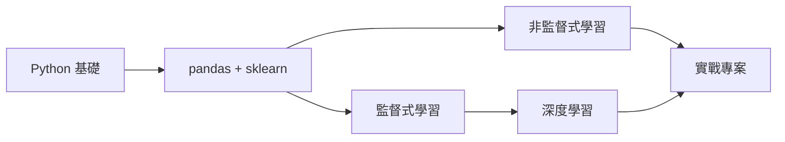

<div class="lesson-header">
  <span class="chapter-tag">第 9 章 · 進階導讀</span>
  <h1>9.1 機器學習路徑</h1>
  <div class="meta">
    <span>⏱️ 20 分鐘</span>
    <span>📖 互動式</span>
    <span>🎯 進階</span>
  </div>
</div>

## 🎯 學習目標

- 認識機器學習全貌
- 知道下一步學什麼


## 🛤️ 學習路徑




## 📚 推薦書

- 周志華《機器學習》（西瓜書）
- Aurélien Géron《Hands-On Machine Learning》
- 吳恩達 Coursera 課


## 🎯 起步

```bash
pip install scikit-learn
```


