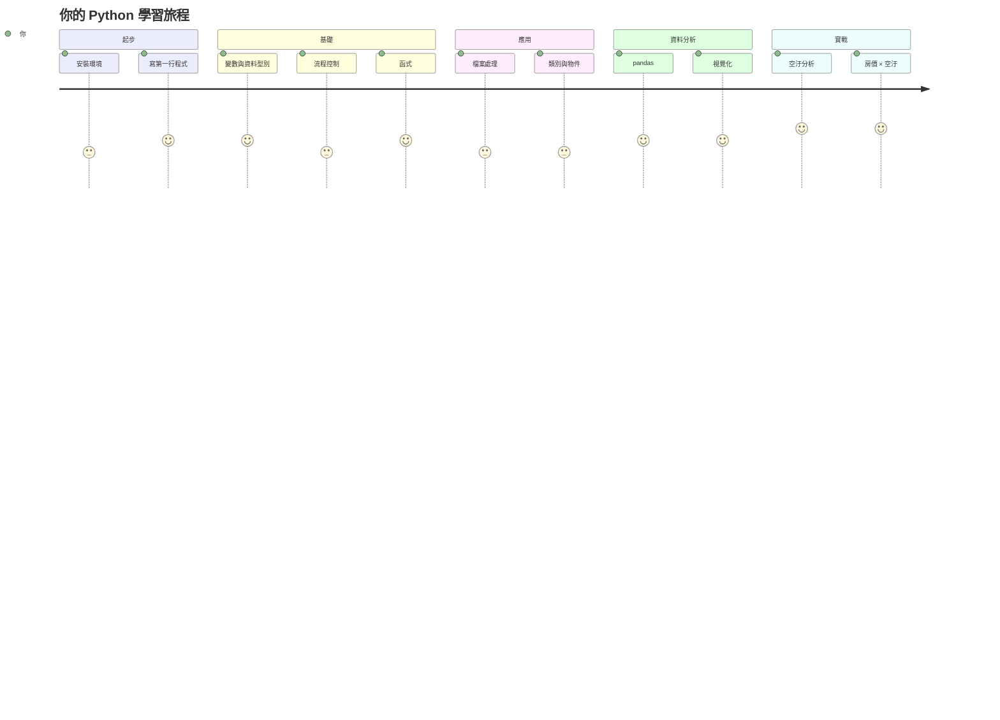

<div class="lesson-header">
  <span class="chapter-tag">第 0 章 · 環境準備</span>
  <h1>為什麼學 Python？</h1>
  <div class="meta">
    <span>⏱️ 5 分鐘</span>
    <span>📖 純閱讀</span>
    <span>🎯 給完全新手</span>
  </div>
</div>

## 🎯 學習目標

讀完這節你會知道：

- Python 在 2026 年仍然是**最值得學的程式語言**之一
- Python 在 5 大真實領域的具體應用
- 這門課會帶你走完怎樣的旅程
- **該不該學** — 給你一個誠實的判斷

## 🤔 程式語言這麼多，為什麼選 Python？

如果你搜過「學什麼程式語言」，一定看過這樣的清單：

- **Python** — AI、資料分析、自動化
- **JavaScript** — 網頁前端
- **Java** — 企業後端、Android App
- **C++** — 系統、遊戲、嵌入式
- **C#** — Windows 桌面、遊戲（Unity）
- **Go** — 雲端、後端服務
- **Rust** — 系統、強調安全
- **SQL** — 資料庫查詢
- **R** — 統計、學術

**為什麼 Python 適合「第一次學程式」？**

| 特性 | Python | 其他語言對比 |
|---|---|---|
| 語法 | 像英文、可讀性高 | C++/Java 像繞口令 |
| 學習曲線 | 平緩 | Java/C++ 陡峭 |
| 套件生態 | 30+ 萬個 | 較少 |
| 應用範圍 | 超廣 | 較專注 |
| 社群 | 全世界最大之一 | 各有社群 |
| 入門門檻 | 一句話就能跑 | 通常要懂編譯 |

**一個對比** — 同樣是「印出 Hello」：

=== "Python"

    ```python
    print("Hello, World!")
    ```

=== "Java"

    ```java
    public class HelloWorld {
        public static void main(String[] args) {
            System.out.println("Hello, World!");
        }
    }
    ```

=== "C++"

    ```cpp
    #include <iostream>
    int main() {
        std::cout << "Hello, World!" << std::endl;
        return 0;
    }
    ```

看到差別了嗎？ Python 用**一行**表達完整意圖，其他語言要寫一堆**樣板**。

!!! info "赫哥老實說"

    Python 也有缺點：**速度比 C++/Java 慢**（動態型別直譯式語言的宿命）。 但 99% 的場景你不需要在意這個 — 你寫的程式慢，是演算法的問題，不是語言的問題。

## 🌍 Python 的 5 大真實應用

### 1️⃣ 資料分析與資料科學 ⭐

這是 Python 最強的領域。

```python
import pandas as pd
import matplotlib.pyplot as plt

# 讀取銷售資料
df = pd.read_csv("sales_2026.csv")

# 算每月總營收
monthly = df.groupby(df["date"].dt.to_period("M"))["revenue"].sum()

# 畫趨勢圖
monthly.plot(kind="line", title="2026 月營收趨勢", figsize=(10, 4))
plt.ylabel("NT$")
plt.grid(True, alpha=0.3)
plt.tight_layout()
plt.show()
```

**誰在用**：資料分析師、商業分析師、產品經理、研究人員、會計。

**真實工具**：`pandas`、`numpy`、`matplotlib`、`seaborn`、`plotly`。

### 2️⃣ 人工智慧與機器學習

從 ChatGPT 到 AlphaFold，AI 革命的背後是 Python。

```python
from sklearn.linear_model import LinearRegression
from sklearn.model_selection import train_test_split

# 訓練一個房價預測模型
X_train, X_test, y_train, y_test = train_test_split(X, y, test_size=0.2)
model = LinearRegression().fit(X_train, y_train)
print(f"R² = {model.score(X_test, y_test):.3f}")
```

**誰在用**：AI 工程師、研究員、博士生、資料科學家。

**真實工具**：`PyTorch`、`TensorFlow`、`scikit-learn`、`Hugging Face`。

### 3️⃣ 自動化與爬蟲

每天要重複做的事，交給 Python。

```python
import requests
from bs101 import BeautifulSoup

# 自動抓今天的新聞標題
response = requests.get("https://news.example.com")
soup = BeautifulSoup(response.text, "html.parser")
headlines = [h.text for h in soup.find_all("h2", class_="headline")]
print(f"今天有 {len(headlines)} 則新聞")
for h in headlines[:5]:
    print(f"  • {h}")
```

**誰在用**：行銷、運營、研究助理、任何想省時間的人。

**真實工具**：`requests`、`BeautifulSoup`、`Selenium`、`playwright`、`pyautogui`。

### 4️⃣ 網站後端

Instagram、Spotify、Pinterest、Dropbox 的後端都有 Python。

```python
from flask import Flask, jsonify

app = Flask(__name__)

@app.route("/api/hello/<name>")
def hello(name):
    return jsonify({"message": f"Hello, {name}!"})

if __name__ == "__main__":
    app.run(debug=True)
```

**誰在用**：後端工程師、全端工程師、創業團隊。

**真實工具**：`Django`、`Flask`、`FastAPI`、`Pyramid`。

### 5️⃣ 科學計算與研究

天文、物理、化學、生物、經濟 — 幾乎所有學科都用 Python 做研究。

```python
# 天文學：用 astropy 計算星系距離
from astropy import units as u
from astropy.cosmology import Planck18

z = 0.5  # 紅移
distance = Planck18.luminosity_distance(z)
print(f"紅移 {z} 的星系距離我們 {distance.to(u.Mpc):.1f}")
```

**誰在用**：教授、研究員、博士生、研究生。

**真實工具**：`SciPy`、`NumPy`、`SymPy`、`pandas`、`statsmodels`、`astropy`。

## 🐍 Python 在台灣

台灣的 Python 社群蓬勃發展：

- **PyCon Taiwan** — 每年最大 Python 年會
- **Taipei.py / Taichung.py** — 各地定期聚會
- **台灣資料科學社群** — 每週線下分享
- **教育部「運算思維」課綱** — Python 已是高中必修

## 💼 Python 職涯市場（2026 台灣）

| 職位 | 月薪範圍 | Python 重要性 |
|---|---|---|
| 資料分析師 | 4-7 萬 | 必備 |
| 後端工程師 | 5-9 萬 | 主力技能 |
| 資料科學家 | 7-15 萬 | 必備 + 統計知識 |
| AI 工程師 | 8-20 萬 | 必備 + ML/DL |
| DevOps 工程師 | 6-10 萬 | 常用 |
| 量化交易員 | 8-30 萬 | 主力 |
| 研究助理 | 3.5-5 萬 | 加分 |

!!! tip "給非本科系的人"

    Python 是**轉職最容易上手**的語言之一。 很多資料分析師、行銷、PM 都是從 Python 入門進入科技業的。 這門課就是為了「非本科系、想用程式解決問題」的人設計的。

## 🎯 這門課會帶你走完怎樣的旅程



**赫哥的承諾**：照著這門課讀 + 寫練習題，**8-12 週後你能自己用 Python 分析真實世界的資料**。

## ❓ 這門課**不適合**誰？

赫哥誠實跟你說，這門課**不適合**：

- ❌ 已經能熟練寫 Python 的人（你可能想看更進階的內容）
- ❌ 想做遊戲開發（Python 不是首選，建議學 C# / Unity）
- ❌ 想做 iOS / Android App（建議學 Swift / Kotlin）
- ❌ 想做網頁前端（建議學 JavaScript / TypeScript）
- ❌ 想做韌體 / 嵌入式（建議學 C / C++）
- ❌ 完全不願意練習的人（程式語言需要動手，光讀沒用）

## ✅ 這門課**適合**誰？

- ✅ **完全沒寫過程式**的小白，想入門
- ✅ 文組 / 商管 / 社科背景，想學資料分析
- ✅ 在職人士想轉職科技業
- ✅ 研究人員 / 研究生需要分析資料
- ✅ 老師 / 教授想用 Python 輔助教學或研究
- ✅ 想用 Python 自動化日常工作的人
- ✅ 已經會一點 Python 想系統化補齊基礎的人

## 💭 給你的最後一句話

> 「學程式最大的門檻不是技術，而是**開始**。」

無數人在「到底要不要學」這個問題上猶豫了幾年。 與其想，不如現在就打開你的終端機，**輸入第一行 Python 程式碼**。

下一章 [0.2 安裝 Python](02-install.md) 會帶你 5 分鐘內把環境架好，**5 分鐘後你就會在螢幕上看到自己的第一支 Python 程式跑起來**。

## 📚 延伸閱讀

- [Python 官方網站](https://www.python.org/) — 永遠的權威
- [Think Python 2e（中譯本）](https://www.books.com.tw/products/0010789412) — 免費電子書，講解清晰
- [PyCon Taiwan](https://tw.pycon.org/) — 台灣 Python 社群
- [TIOBE Index](https://www.tiobe.com/tiobe-index/) — 看 Python 排名
- [Stack Overflow Survey](https://survey.stackoverflow.co/2024/) — 各語言使用率調查

---

下一課：[0.2 安裝 Python](02-install.md) → 5 分鐘把環境架起來 🛠️
