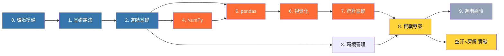

---
hide:
  - navigation
  - toc
---

  <h1>Python 學堂</h1>
  
從零基礎到數據分析，60+ 章節、4 個完整實戰專案。 用乾淨有創意的方式，學會 Python。

  

    🐍 Python 3.11+
    ⚡ 60+ 章節
    🎯 4 個實戰
    📊 pandas / NumPy
    🇹🇼 台灣在地化
    🆓 永久免費
  

  
71內容檔案

  
9主題章節

  
4+實戰專案

  
5附錄速查

## 🎯 為什麼選這堂課？

這不是另一份「Python 入門教學」。**Python 學堂** 是為**完全沒寫過程式的學習者**設計的完整路徑，目標是「從零到能自己用 Python 分析真實世界的資料」。

  <a class="card" href="intro/">
    🚀
    
零基礎友善

    
從「Python 是什麼」開始，每一步都有完整解釋與可執行的範例。

  </a>
  <a class="card" href="chapter05_pandas/01-intro/">
    📊
    
真實資料驅動

    
使用台灣政府公開資料（空污、實價登錄、Threads）做實戰，學會立刻能用。

  </a>
  <a class="card" href="chapter07_stats/06-misuse/">
    🧠
    
科學素養導向

    
統計章節附「常見誤用警示」，訓練你看懂 p-hacking、辛普森悖論。

  </a>
  <a class="card" href="chapter0X_setup/02-install/">
    🛠️
    
環境最佳實踐

    
從 venv 到 poetry，教你像專業工程師一樣管理 Python 環境。

  </a>
  <a class="card" href="chapter08_projects_extra/05-air-vs-house/">
    🏠
    
空汙 × 房價實戰

    
獨家章節：用 twinkle-hub 整合環保署 AQI 與實價登錄，做完整分析。

  </a>
  <a class="card" href="appendix/C-resources/">
    📚
    
完整學習路徑

    
9 章主軸 + 5 個附錄 + 100+ 練習題 + 30+ 程式碼範例。

  </a>

## 🗺️ 學習路徑圖

## 📖 章節總覽

| 章 | 主題 | 小節數 | 重點 |
|---|---|---|---|
| 0 | 環境準備 | 5 | 安裝、VS Code、第一支程式 |
| 1 | 基礎語法 | 10 | 變數、字串、list、dict、流程、函式 |
| 2 | 進階基礎 | 8 | 檔案、例外、模組、類別 |
| 3 | 環境管理 | 5 | venv / conda / poetry（專業工程師必備） |
| 4 | NumPy | 6 | ndarray、broadcasting、統計 |
| 5 | pandas | 10 | 讀寫、清洗、groupby、時間序列 |
| 6 | 視覺化 | 8 | matplotlib + seaborn + plotly |
| 7 | 統計基礎 | 6 | 檢定、迴歸、避免誤用 |
| 8 | 實戰專案 | 4 | 空氣品質 / 銷售 / Threads / 環境經濟 |
| **8.5** | **空汙 × 房價** | **1** | **🆕 twinkle-hub 整合實戰** |
| 9 | 進階導讀 | 3 | ML / 爬蟲 / 部署 |
| 附錄 | - | 5 | 速查 / FAQ / 資源 / 術語 / 答案 |

## 🚀 立即開始

  <a class="card" href="chapter0X_setup/01-why-python/">
    📘
    
完全新手？

    
從「為什麼學 Python」開始 →

  </a>
  <a class="card" href="chapter01_basics/01-variables-types/">
    ⚡
    
有基礎想複習？

    
直接進入第 1 章基礎語法 →

  </a>
  <a class="card" href="chapter05_pandas/01-intro/">
    🐼
    
想直接學資料分析？

    
跳到第 5 章 pandas 開始 →

  </a>
  <a class="card" href="chapter08_projects_extra/05-air-vs-house/">
    🏠
    
想看實戰案例？

    
空汙 × 房價實戰專案 →

  </a>

---

**本站使用 [Open Design 0.9.0](https://github.com/nexu-io/open-design) 啟發的設計風格 · 本站內容採用 MIT 授權 · 程式碼範例皆可自由使用**
